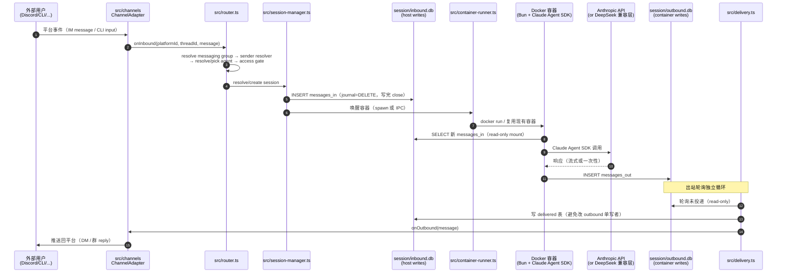

# NanoClaw v2 架构探索 — 二开前置理解

> **产出场景**：九天智课 · Claude Superpowers 课程 · 入门段 Step 7（brainstorming 探索）
> **日期**：2026-05-07
> **方法**：Superpowers `brainstorming` skill · 扫源码 → 分类 → 找扩展点 → 画 mermaid → 沉淀
> **范围**：NanoClaw v2.0.33（227 个 TS 文件，src/ 105 个）
> **目的**：二开前先把全局图建起来。NanoClaw 哲学是 "small enough to understand"，对应的工程纪律是"先理解、再动手"。

---

## 一、文件分类全景（按职责）

NanoClaw 是个**纯薄编排层**——`src/index.ts` 自述："Thin orchestrator: init DB, run migrations, start channel adapters, start delivery polls, start sweep, handle shutdown."

把 src/ 的 105 个 TS 文件按职责分成 6 大类：

### 1. 消息进出层（src/channels/, 8 文件）

把 NanoClaw 接到外部消息平台。
- `adapter.ts` — `ChannelAdapter` 接口定义（onInbound / onOutbound / onPlatformIdResolve）
- `channel-registry.ts` — channel name → adapter 实现的注册表
- `chat-sdk-bridge.ts` — Discord / Slack / Teams / Telegram / WhatsApp / iMessage / Signal 共用桥（基于 OneCLI 的 Chat SDK）
- `cli.ts` — 命令行 channel（synthetic platform，纯本地调试入口）
- `ask-question.ts` — 反向通道：agent 主动向用户问问题

### 2. 路由 & 会话层（src/router.ts + src/session-manager.ts + src/delivery.ts）

消息进入后的核心调度三件套：
- `router.ts` — 入站路由：channel 事件 → resolve messaging group → sender resolver → resolve/pick agent → access gate → resolve/create session → 写 messages_in → 唤醒容器
- `session-manager.ts` — 会话生命周期 + 两 DB 文件夹结构 + 容器状态追踪
- `delivery.ts` — 出站投递：轮询 outbound.db 的未投递消息 → 通过 channel adapter 推回平台

### 3. 容器执行层（src/container-runtime.ts + src/container-runner.ts + src/container-config.ts）

把 agent 跑在 Docker 容器里：
- `container-runtime.ts` — runtime 抽象（docker / podman / orbstack 兜底）
- `container-runner.ts` — 真正 spawn 容器进程的地方
- `container-config.ts` — 容器配置（mounts / env / image）

### 4. 数据持久化层（src/db/, 22 文件）

SQLite 三 DB 架构：
- **central db**（`v2.db`）— 全局状态：users / agent-groups / messaging-groups / wiring / permissions
- **session inbound.db** — host 写、container 只读（messages_in）
- **session outbound.db** — container 写、host 只读（messages_out）

关键文件：
- `connection.ts` — DB 连接管理（WAL/DELETE 模式选择）
- `migrations/` — schema 演进
- `agent-groups.ts` / `messaging-groups.ts` / `sessions.ts` — 三大核心实体的 CRUD

### 5. 业务能力模块（src/modules/, 38 文件）

可插拔的"能力"——每个模块向 router / runner 注册 hook：
- `permissions/` — 用户角色 + access gate（owner / admin / member）
- `approvals/` — agent 行动审批（OneCLI 接管的危险动作让用户确认）
- `agent-to-agent/` — agent 互相 @ 调用
- `scheduling/` — 定时任务（cron + 一次性任务）
- `self-mod/` — agent 修改自己的 CLAUDE.md（持久学习）
- `interactive/` — 交互式提问反馈
- `mount-security/` — 容器挂载允许列表
- `typing/` — 模拟"输入中..."状态

### 6. Agent 容器内部（container/agent-runner/）

容器里跑的代码：用 **Bun** + **Claude Agent SDK** 走 Anthropic Messages API 协议。从 inbound.db 拉消息 → 调 Claude → 写 outbound.db。

> **关键观察**：容器里的代码用 Bun（`exec bun run /app/src/index.ts`），host 上用 Node + tsx。Bun 是为容器启动速度选的——冷启 < 1s。

---

## 二、核心模块职责边界（4 个区域 · 二开必背）

> 这 4 块是后续课程案例段最常改的区域。把边界讲清楚，**改一个不会爆三个**。

### A. `src/channels/`（消息通道适配器）

**职责**：把 NanoClaw 接进任何外部消息系统。
**稳定 API**：`ChannelAdapter` 接口（adapter.ts）—— 实现 `onInbound` / `onOutbound` 即可成为新 channel。
**可改区**：新增一个 `channels/your-channel.ts` + 在 `channel-registry.ts` 注册。
**红线**：不要改 `chat-sdk-bridge.ts`——它是 7 个 Chat SDK 平台共用底座，改一处坏一片。

### B. `src/modules/`（业务能力模块）

**职责**：往核心流程里挂"行为 hook"——每个模块**自包含**，通过向 router / session-manager / runner 注册回调来扩展能力。
**稳定 API**：`router.ts` 暴露 `setSenderResolver` / `setAccessGate` 等 hook 注册点（`index.ts` 里的 `setXxx` 函数）。
**可改区**：新增一个 `modules/your-module/` 目录，按现有 `permissions/` 的模板写：`index.ts` 里 `register()` 注册 hook、`db/` 放本模块独占的表。
**红线**：模块之间**禁止互相 import**——所有交互通过 router 暴露的 hook。打破这条 = 课程 A2/A3 案例的反模式起点。

### C. `src/db/`（数据持久化）

**职责**：三 DB 架构的实现层。
**稳定 API**：每张表对应的 CRUD 函数（`agent-groups.ts` 的 `createAgentGroup` / `getAgentGroupByFolder` 等）。
**可改区**：新增表 → 写 migration（`migrations/00X-your-table.ts`）+ 写一个新 `db/your-entity.ts` 暴露 CRUD。
**红线**：
1. session 的 inbound/outbound DB **journal_mode=DELETE 不能改成 WAL**——`session-manager.ts` 文件头有载入式不变量说明：跨容器挂载下 WAL 的 mmapped -shm 不会刷新到 guest，会丢消息。
2. host 写完必须 close 连接——长连接会冻结 container 的页缓存视图。
3. 一份 DB 文件单一写者——DELETE 模式 journal-unlink 跨挂载非原子。

### D. `container/`（Agent 容器化）

**职责**：把每个 agent group 跑在独立 Docker 容器里。
**稳定 API**：容器入口是 `container/agent-runner/src/index.ts`（Bun 跑），从环境变量读取 mount path 做事。
**可改区**：
- `container/CLAUDE.md` — 所有 agent 共享的 base prompt
- `groups/{folder}/CLAUDE.md` — 单个 agent 的 system prompt（A6 Gates 案例就改这里）
- `container/skills/` — 容器内 Skills（host 的 `.claude/skills/` 是 Claude Code 的，两套）
**红线**：不要改 `Dockerfile` / `entrypoint.sh` 除非要重建 base image——base 镜像有 install-slug label 用于 setup orphan 清理。

---

## 三、扩展点 vs 内部实现（upstream 冲突评估）

> NanoClaw 没有"插件系统"——所有扩展都是改源码。要二开**就要 fork**。下表是冲突风险评级：

| 改动位置 | 冲突风险 | 推荐策略 |
|---------|:-------:|---------|
| `src/channels/your-channel.ts`（新文件）+ 注册表加一行 | 🟢 低 | 直接 fork，upstream 合并基本无冲突 |
| `src/modules/your-module/`（新目录） | 🟢 低 | 同上 |
| `groups/{folder}/CLAUDE.md`（用户数据，非源码） | 🟢 零 | 不在 git 跟踪范围 |
| `container/CLAUDE.md` | 🟡 中 | upstream 偶尔会改，patch 维护即可 |
| `src/router.ts` / `src/session-manager.ts` 加 hook 点 | 🔴 高 | 优先尝试用现有 hook；非加不可时提 PR 给 upstream |
| `src/db/migrations/` 加表 | 🟡 中 | migration 编号要避让 upstream（用大编号 5xx+） |
| `src/container-runner.ts` 改容器启动逻辑 | 🔴 高 | 几乎不要碰——base image 假设固定 |
| `Dockerfile` / `entrypoint.sh` | 🔴 极高 | install-slug 机制依赖它，改了会让 setup orphan 清理失效 |

**🔥 关键观察**：NanoClaw 自己的 `docs/BRANCH-FORK-MAINTENANCE.md` 写明了这套规则（"skills as branches" 的设计哲学）——后续课程案例段 A2-A5 的二开都遵循这个脊椎。

---

## 四、消息端到端流程（mermaid）

**关键不变量（图里塞不下、二开必须记住）**：
- session 的 inbound.db 和 outbound.db 是**两个文件**，不是一个 DB 两张表——为了"单写者"
- host 永远不写 outbound.db；container 永远不写 inbound.db——跨容器 SQLite 的硬约束
- delivery 不删 outbound，靠 host 侧 inbound.db 的 `delivered` 表记账

---

## 五、给课程案例段的"已会假设"

入门段 Step 7 跑通这份探索，意味着学员后续已经知道：

1. ✅ NanoClaw 是"消息进 → router → session → 容器 → API → 容器 → delivery → 消息出"的薄编排层
2. ✅ Agent group = 独立 Docker 容器 + 独立 CLAUDE.md + 独立 SQLite 三件套
3. ✅ 改 CLAUDE.md = 改 agent system prompt（A6 Gates 案例直接用这个）
4. ✅ 模块化扩展走 `src/modules/your-module/`（A2/A3 案例的反模式起点）
5. ✅ 容器内用 Claude Agent SDK 走 Anthropic Messages API（DeepSeek-V4 走 `/anthropic` 兼容层即可，无需改 NanoClaw 一行代码）

---

## 六、本次探索的元层学习（沉淀给 Superpowers 经验库）

> Jesse 自述用 brainstorming 做"探索"而不是"写需求"——这是 brainstorming skill 的隐藏用法。本次探索的方法论：

1. **先看 entry point**：`src/index.ts` 文件头注释 = 项目自述。NanoClaw 这种小项目，header 注释往往就是最佳一句话总结。
2. **再看子目录数量分布**：`src/modules/` 38 文件、`src/db/` 22、`src/channels/` 8——这告诉你"业务复杂度集中在 modules，DB 设计也很重，外部接入相对薄"。
3. **每个核心文件读 15 行 header**：load-bearing invariants 通常写在文件头注释里（如 session-manager 的"三个跨挂载不变量"）。
4. **画 mermaid 之前先把动作链路用名词列出来**：channel → router → session → DB → container → API → DB → delivery → channel。一旦这条链有了，mermaid 就是把它画出来而已。
5. **冲突风险表**：fork 一个项目前，必须有一张"哪改了 upstream 合并不冲突 / 哪改了死活不能合"的表。NanoClaw 案例里这表只有 8 行，但每行都防一个未来的事故。

---

> **下一步**：把这份探索写进了 `docs/superpowers/specs/`，后续会话直接 reference 即可，不需要重新探索整个 codebase。这正是 Superpowers `spec-driven` 的核心——把一次性的认知工作沉淀为可复用的 spec。
